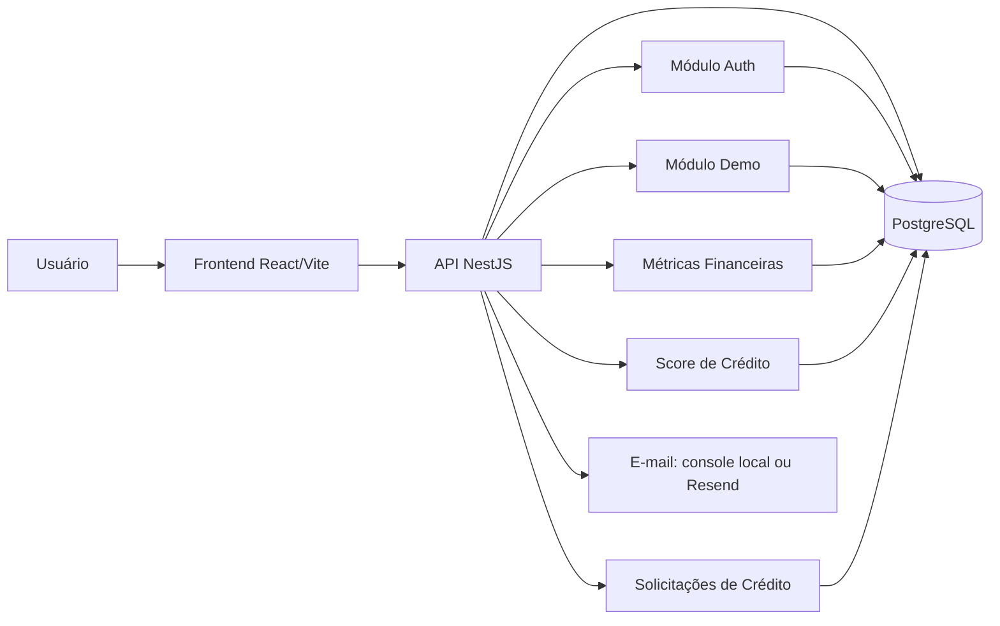

# Documento da Solução

## 1. Visão Geral

### Problema

Autônomos e profissionais liberais podem ter dificuldade para acessar crédito quando a avaliação depende de comprovantes tradicionais de renda. O projeto busca demonstrar uma forma simples de avaliar comportamento financeiro a partir de movimentações, saldo e recorrência de renda.

### Solução

O FluxCred permite criar uma conta, conectar um perfil demonstrativo, visualizar o dashboard financeiro, consultar score de crédito e solicitar crédito. Em ambiente local, os perfis demo geram contas, transações, métricas e score sem depender de integração bancária externa.

## 2. Arquitetura

### Diagrama

O diagrama está em [architecture-diagram.mmd](./architecture-diagram.mmd).

### Principais Componentes

- Frontend: aplicação React com Vite para cadastro, login, dashboard, análise, score, conexão demo e solicitação de crédito.
- API: backend NestJS com módulos de autenticação, usuários, demo, contas, transações, métricas, score e solicitações.
- Banco: PostgreSQL acessado via Prisma.
- E-mail: em desenvolvimento, os links de verificação e redefinição de senha são impressos no console; em produção, pode ser usado Resend.
- Demo: gera massa de dados local para quatro perfis financeiros: excelente, aprovado, limítrofe e recusado.

A infraestrutura usada para deploy está documentada em [Infraestrutura e Deploy](./infrastructure.md).

## 3. Modelo de Score

### Dados Utilizados

O score usa métricas derivadas das transações do usuário:

- frequência de renda;
- estabilidade da renda;
- relação entre despesas e receitas;
- saldo médio;
- volume médio de renda;
- penalidades de risco.

### Cálculo das Métricas

As métricas financeiras são calculadas a partir de um período informado ou dos últimos 90 dias:

- `totalIncome`: soma das transações de crédito.
- `totalExpense`: soma absoluta das transações de débito.
- `avgMonthlyIncome`: renda média mensal.
- `incomeDays`: dias com entrada de renda.
- `noIncomeDays`: dias sem entrada.
- `expenseRatio`: despesas divididas por receitas.
- `averageBalance`: média dos saldos após transações.

### Cálculo do Score

O score final vai de 0 a 1000. Primeiro, é calculada uma base de 0 a 100:

- frequência de renda: até 25 pontos;
- estabilidade da renda: até 20 pontos;
- fluxo de caixa: até 20 pontos;
- saldo médio: até 15 pontos;
- volume de renda: até 10 pontos;
- penalidade de risco: até 30 pontos negativos.

A base é limitada entre 0 e 100 e multiplicada por 10.

### Regras de Aprovação

- Score igual ou superior a 600: aprovado.
- Score abaixo de 600: recusado.
- Para score igual ou superior a 800, o limite recomendado é 30% da renda média mensal.
- Para score entre 600 e 799, o limite recomendado é 15% da renda média mensal.
- A solicitação de crédito é aprovada apenas se o valor solicitado estiver dentro do limite recomendado.

## 4. Decisões Técnicas

### Tecnologias Escolhidas

- NestJS: estrutura modular para a API.
- Prisma: acesso tipado ao PostgreSQL e migrations versionadas.
- PostgreSQL: banco relacional adequado para usuários, contas, transações e histórico de score.
- React + Vite: frontend leve, rápido e simples de executar localmente.
- TanStack Query: carregamento e cache de dados no frontend.
- Tailwind CSS: construção rápida de interfaces responsivas.
- Resend: opção simples para envio real de e-mail.
- Dokploy: facilita deploy, configuração de serviços, logs e automação em uma VPS própria.
- Traefik: proxy reverso para expor API e frontend por subdomínios.
- Cloudflare: gerenciamento de DNS e apontamento dos subdomínios.

### Trade-offs

- O projeto usa dados demonstrativos locais em vez de integração bancária real neste momento. Isso reduz dependência externa e facilita testes, mas não representa conectividade real com bancos.
- A verificação de e-mail é mantida no fluxo local usando links no console. Isso preserva o comportamento real sem exigir conta de e-mail transacional.
- O modelo de score é determinístico e simples. Ele é explicável, mas não substitui modelos estatísticos ou validação com dados reais.
- O refresh token usa cookie HTTP-only, enquanto o access token fica em memória no frontend. Isso reduz persistência indevida do token de acesso, mas exige refresh após reload.

## 5. Limitações e Melhorias Futuras

### Limitações

- Não há integração bancária externa ativa.
- O score foi definido por regras fixas e não por modelo treinado.
- Os perfis demo são sintéticos.
- Não há painel administrativo.
- O fluxo de crédito aprova ou recusa automaticamente; não há revisão manual.
- A nomenclatura interna ainda possui referências históricas a `pluggy` em entidades de banco usadas como conexões.

### Melhorias Futuras

- Renomear entidades internas de conexão para termos neutros, como `connectionItem`.
- Adicionar testes automatizados para garantir faixas esperadas dos perfis demo.
- Criar testes e2e cobrindo cadastro, verificação por console, login, conexão demo, score e solicitação de crédito.
- Reintroduzir uma integração bancária real quando houver credenciais e escopo de produto definidos.
- Evoluir o score com dados reais, validação estatística e acompanhamento de performance.
- Adicionar observabilidade, logs estruturados e tratamento mais detalhado de erros em produção.

Uma lista mais completa está em [Melhorias Futuras](./future-improvements.md).
